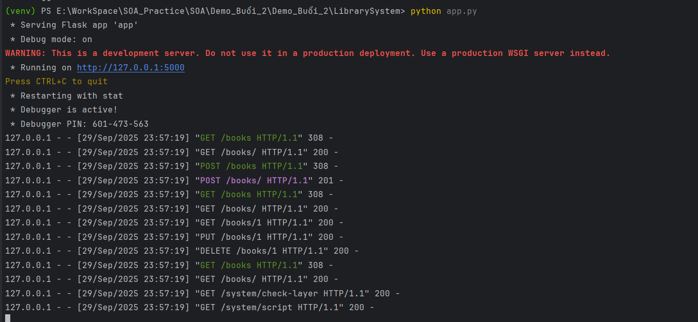
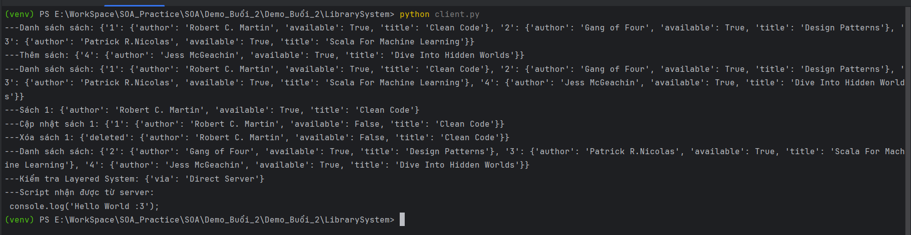

# LibrarySystem RESTful Demo

Demo hệ thống thư viện đơn giản (quản lý sách, mượn – trả sách) được xây dựng bằng **Flask**.  
Mục tiêu là minh họa 6 nguyên tắc cơ bản của RESTful API:

1. **Client–Server**  
   - Server: Flask cung cấp API (`/books`, `/borrow`, `/system`)  
   - Client: Python script (`client.py`) có thể dùng Postman để curl  

2. **Stateless**  
   - Mỗi request từ client phải kèm đầy đủ thông tin (header Authorization).  
   - Server không lưu session của client giữa các request.  

3. **Cacheable**  
   - Ví dụ trong code: API `/books` trả về dữ liệu có header `Cache-Control` dùng `CACHE_TIMEOUT` được định nghĩa trong config.py.  
   - Cho phép client hoặc proxy cache response.  

4. **Layered System**  
   - Endpoint `/system/check-layer` minh họa request có thể đi qua nhiều tầng (proxy, load balancer...).  
   - Server kiểm tra header `Via`.  

5. **Uniform Interface**  
   - Sử dụng các HTTP methods chuẩn:
     - `GET /books` – lấy danh sách sách
     - `POST /books` – thêm sách
     - `GET /books/<id>` – lấy thông tin sách
     - `PUT /books/<id>` – cập nhật sách
     - `DELETE /books/<id>` – xóa sách  

6. **Code on Demand** (tùy chọn)  
   - Endpoint `/system/script` trả về một đoạn **JavaScript** mà client có thể thực thi.   

---

## Cài đặt và khởi chạy
### 1. Tạo môi trường ảo (nếu chưa có)
```bash
python -m venv venv
source venv/bin/activate   # Linux/Mac
venv\Scripts\activate      # Windows
```

### Cài đặt dependencies
Trước tiên, di chuyển vào thư mục chứa file `App.py` và `client.py`:
```bash
pip install -r requirements.txt
```
###  Chạy server Flask
```bash
python App.py
```

###  Chạy server Flask
```bash
python client.py
```

## Kết quả
### Chạy Server

### Chạy Client



