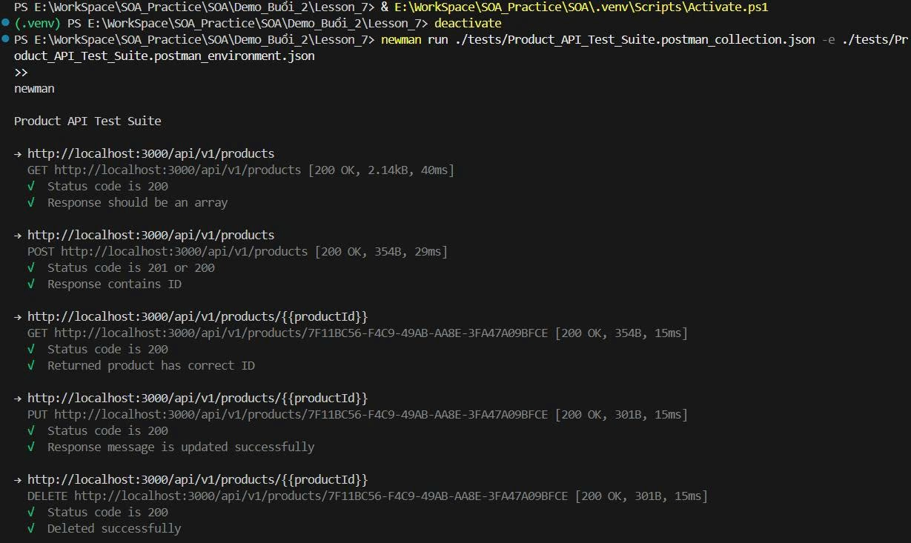
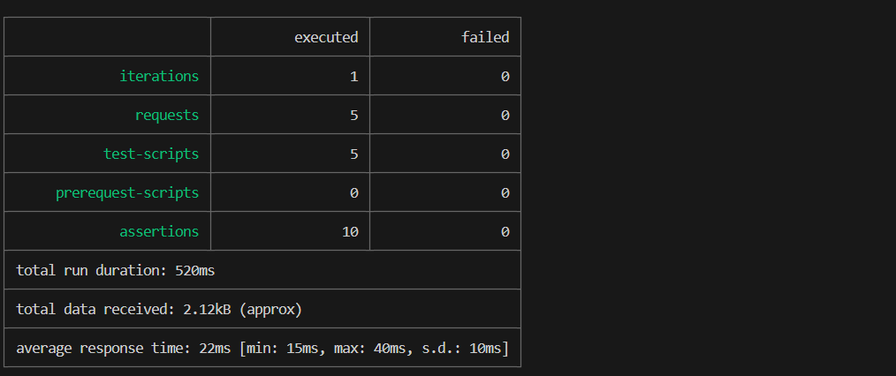

# Test API bằng Newman
Export file json từ Postman để chạy newman
## Câu lệnh sử dụng
    newman run ./tests/Product_API_Test_Suite.postman_collection.json -e ./tests Product_API_Test_Suite.postman_environment.json

## Kết quả chạy

